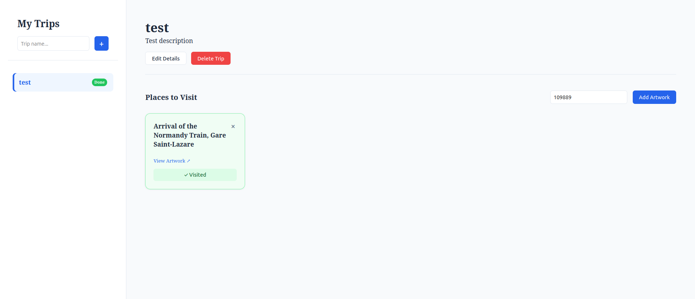

# Travel Planner System

## Features

- Create travel projects
- List all projects
- Get single project details
- Update project information
- Delete projects (with validation)
- Auto-complete projects when all places visited 
- Add places from Art Institute API to projects
- Create projects with initial places in one request
- List all places in a project
- Get single place details
- Update place notes
- Mark places as visited/unvisited
- Remove places from projects
- Maximum 10 places per project
- Prevent duplicate places in same project
- Validate places exist in Art Institute API before adding
- Prevent deletion of projects with visited places
- Auto-mark project completed when all places visited

## Tech Stack

* **Frontend**: React 18, TypeScript, Vite, CSS3
* **Framework**: FastAPI 0.109
* **Database**: SQLAlchemy 2.0 + SQLite + aiosqlite
* **Async**: asyncio with async/await
* **HTTP Client**: httpx
* **Validation**: Pydantic 2.5
* **Package Manager**: uv (Backend) & npm (Frontend)
* **Containerization**: Docker & Docker Compose

## Quick Start

### Prerequisites

* Python 3.10+
* Node.js & npm
* uv package manager ([install](https://docs.astral.sh/uv/))
* Docker & Docker Compose (optional)

### Local Development

1. **Clone and setup**

```bash
git clone https://github.com/GitEagleY/Crewred_task.git
cd travel-planner
uv sync

```

2. **Run the Backend server**

```bash
uv run uvicorn app.main:app --reload

```

3. **Run the Frontend server**

```bash
cd travel-planner-frontend
npm install
npm run dev

```

### Docker

1. **Build and run**

```bash
docker-compose up --build

```

2. **Access the System**

* **Frontend Dashboard**: `http://localhost:5173`
* **Backend API Docs**: `http://localhost:8000/docs`

3. **Stop**

```bash
docker-compose down

```

## API Endpoints

### Projects

| Method | Endpoint | Description |
| --- | --- | --- |
| `POST` | `/projects` | Create project |
| `GET` | `/projects` | List all projects |
| `GET` | `/projects/{id}` | Get single project |
| `PATCH` | `/projects/{id}` | Update project |
| `DELETE` | `/projects/{id}` | Delete project |

### Places

| Method | Endpoint | Description |
| --- | --- | --- |
| `POST` | `/projects/{id}/places` | Add place to project |
| `GET` | `/projects/{id}/places` | List places in project |
| `GET` | `/projects/{id}/places/{place_id}` | Get single place |
| `PATCH` | `/projects/{id}/places/{place_id}` | Update place notes/status |
| `DELETE` | `/projects/{id}/places/{place_id}` | Remove place |

## Environment Variables

| Variable | Default | Description |
| --- | --- | --- |
| DATABASE_URL | sqlite+aiosqlite:///./travel.db | Database connection string |
| VITE_API_URL | http://localhost:8000 | Backend URL for frontend |
| LOG_LEVEL | info | Logging level |

## API Documentation

### Interactive Docs

* **Swagger UI**: http://localhost:8000/docs
* **ReDoc**: http://localhost:8000/redoc

## Example Requests

### Create Project with Places

```bash
curl -X POST http://localhost:8000/projects \
  -H "Content-Type: application/json" \
  -d '{
    "name": "Museum Tour",
    "description": "Famous artworks to see",
    "start_date": "2024-07-15",
    "places": [
      {"external_api_id": "16571", "notes": "Van Gogh masterpiece"},
      {"external_api_id": "109889", "notes": "Iconic night scene"}
    ]
  }'
```

**Response (201 Created):**
```json
{
  "id": 1,
  "name": "Museum Tour",
  "description": "Famous artworks to see",
  "start_date": "2024-07-15",
  "completed": false,
  "places": [
    {
      "id": 1,
      "external_api_id": "16571",
      "external_api_title": "The Night Café",
      "external_api_url": "https://www.artic.edu/artworks/16571/...",
      "notes": "Van Gogh masterpiece",
      "visited": false
    },
    {
      "id": 2,
      "external_api_id": "109889",
      "external_api_title": "The Starry Night",
      "external_api_url": "https://www.artic.edu/artworks/109889/...",
      "notes": "Iconic night scene",
      "visited": false
    }
  ]
}
```

### Add Place to Existing Project

```bash
curl -X POST http://localhost:8000/projects/1/places \
  -H "Content-Type: application/json" \
  -d '{
    "external_api_id": "28560",
    "notes": "Must see at Art Institute"
  }'
```

### Mark Place as Visited

```bash
curl -X PATCH http://localhost:8000/projects/1/places/1 \
  -H "Content-Type: application/json" \
  -d '{"visited": true}'
```

### List Project Places

```bash
curl http://localhost:8000/projects/1/places
```

## Requirements Fulfillment

### Backend Requirements

#### Travel Projects
- Create travel projects with Name, Description (optional), Start Date (optional)
- Remove projects from system
- Validate: cannot delete if any places are marked visited
- Update project information
- List all projects
- Get single project

#### Places / Project Places
- Create project with places in single request
- Import places from Art Institute API
- Validate place exists in API before storing
- Add place to existing project
- Update place notes
- Mark place as visited
- List all places for project
- Get single place in project
- Remove place from project

## Bonus

* **Full Stack Integration**: Real-time React dashboard with TypeScript.
* Docker & docker-compose configuration
* Clean project structure
* Meaningful commit history
* Async/await throughout
* Proper error handling
* Input validation with Pydantic
